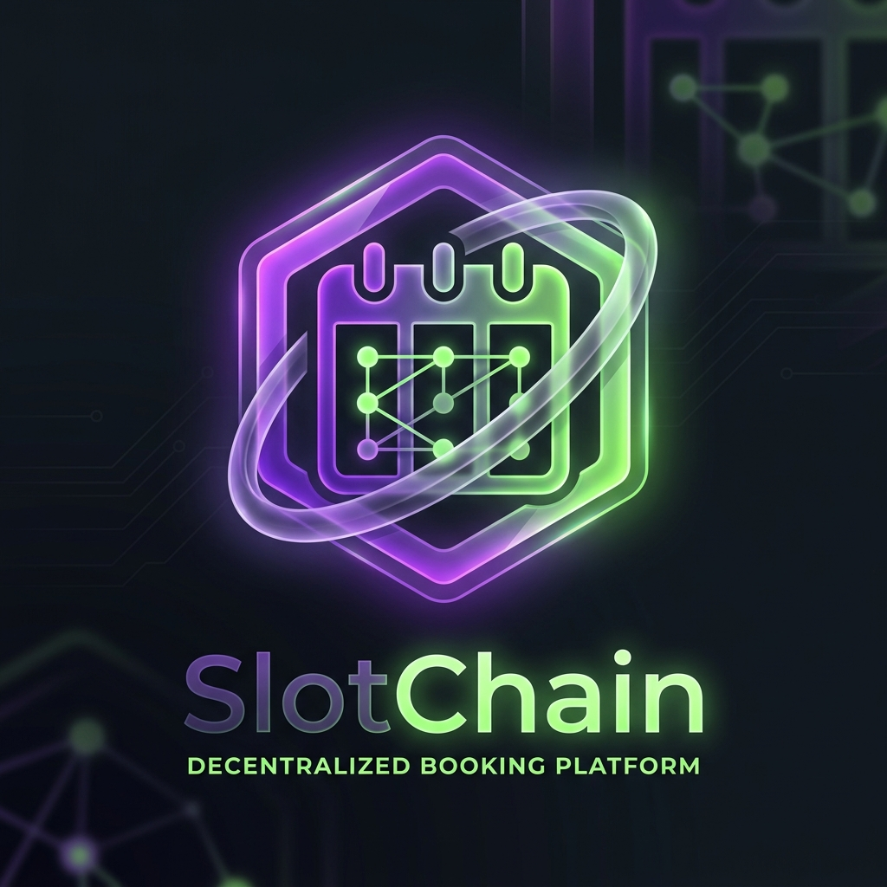
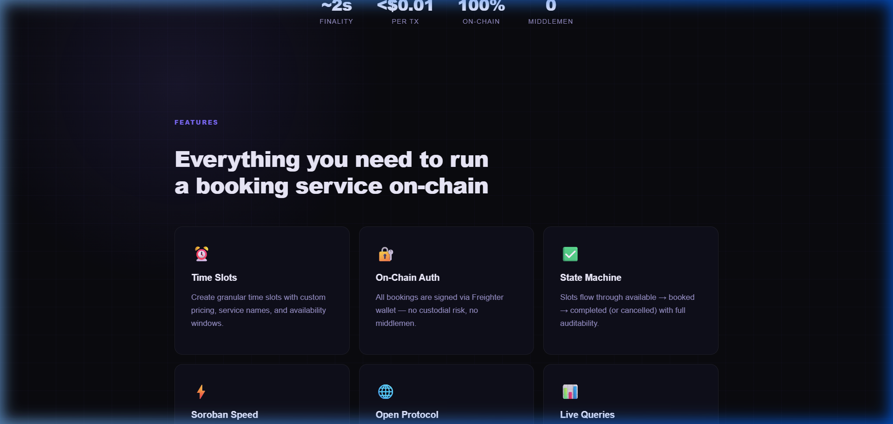
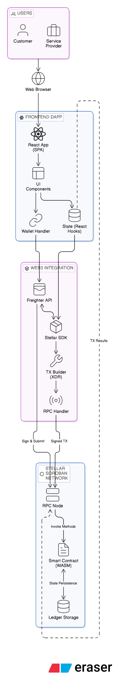
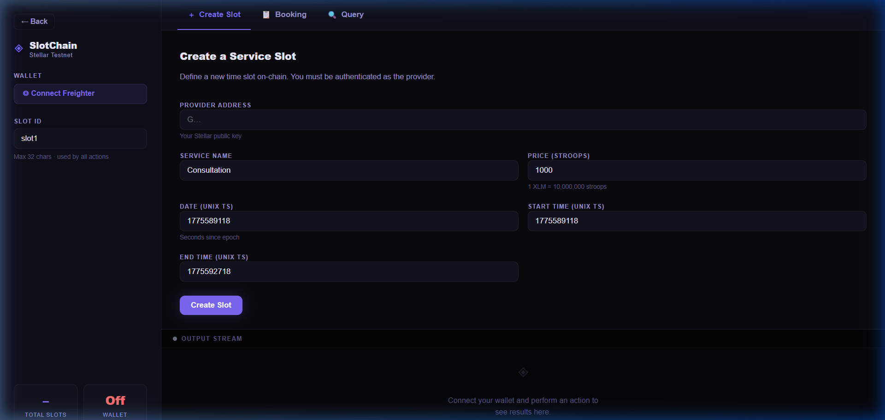
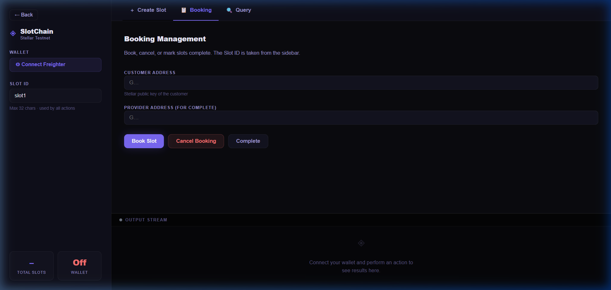
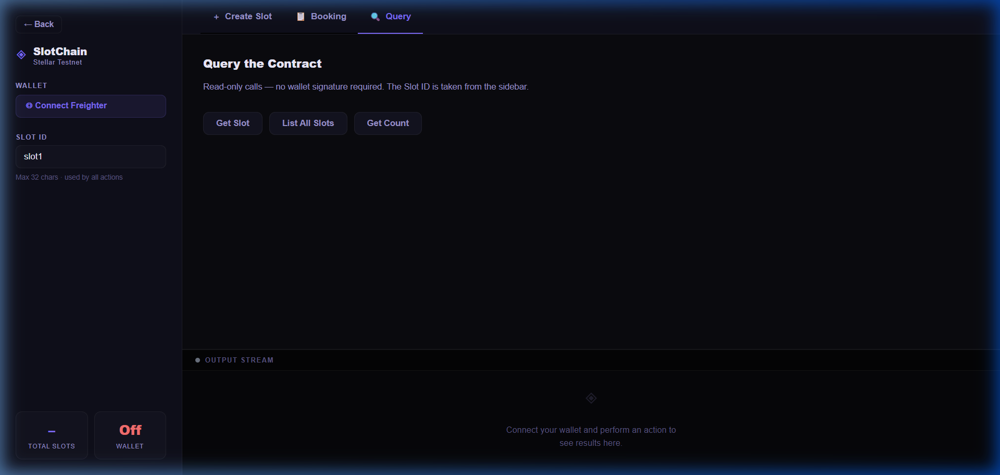
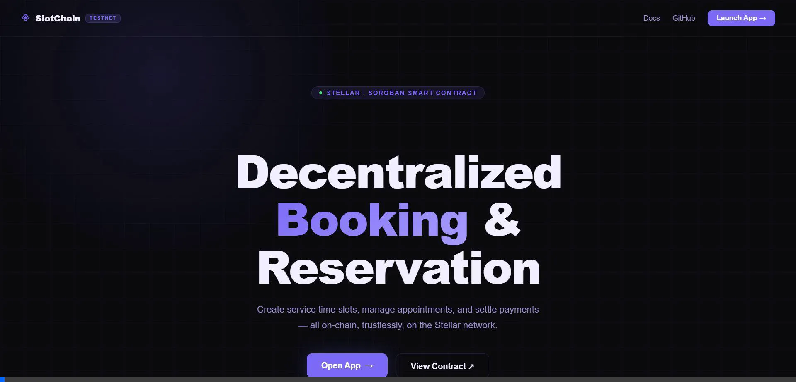

<div align="center">
  
  <h1>SlotChain</h1>
  <p><strong>Decentralized Booking and Reservation Platform</strong></p>
</div>

<br/>



## Overview

**SlotChain** is a decentralized scheduling and booking application built on the **Stellar network using Soroban Smart Contracts**. It removes intermediaries from the booking process, allowing service providers to list un-custodial time slots directly on-chain and giving customers the ability to book appointments securely via their Web3 wallets.

With sub-second transaction finality, minimal fees, and an audited on-chain state machine, SlotChain represents the next evolution of transparent, trustless reservations.

## High-Level System Architecture

SlotChain leverages a modern web stack coupled with the power of Stellar smart contracts.
The architecture comprises three main tiers:

<div align="center">
  
  <br/>
  <em>End-to-end system architecture of the SlotChain platform</em>
</div>

<br/>

### 1. Smart Contract Tier (Stellar / Soroban)
- **State Machine**: Time slots act as on-chain assets that transition through states (`Available` -> `Booked` -> `Completed`/`Cancelled`).
- **Authorization**: Strict authorization checks are performed inside the contract; only the designated Provider can complete or cancel certain slots, and bookings lock the slot to the assigned Customer.
- **Language**: Written in Rust using the Soroban SDK.

### 2. DApp / Client Tier (React + Vite)
- **Framework**: Built with React and Vite for a highly responsive, single-page application experience.
- **UI/UX**: Premium, glassmorphic dark-mode interface built to provide seamless wallet interactions.
- **Wallet Connection**: Integrates exclusively with the Freighter wallet browser extension for securing user identities and authorizing transactions securely via `@stellar/freighter-api`.

### 3. Integration & Network Tier
- **Stellar SDK Integration**: Uses `@stellar/stellar-sdk` to simulate and submit Soroban transactions on the Stellar testnet or mainnet.
- **RPC Nodes**: DApp interacts with standard Stellar RPC endpoints to fetch real-time state and list slots without requiring custodial backend databases.

## 🚀 Getting Started & Proceeding with the Project

If you want to run, modify, or extend this project, follow this documentation:

### Prerequisites
- [Node.js](https://nodejs.org/en/) (v18+)
- [Rust](https://www.rust-lang.org/tools/install) and `soroban-cli` for smart contract development.
- The [Freighter Wallet](https://www.freighter.app/) extension installed in your browser.

### Development Setup

1. **Clone the Repository**
   ```bash
   git clone https://github.com/krish-crlt/booking-reservation-app.git
   cd booking-reservation-app
   ```

2. **Install Frontend Dependencies**
   ```bash
   npm install
   ```

3. **Run the Development Server**
   ```bash
   npm run dev
   ```
   Open `http://localhost:5173` in your browser.

4. **Compile Smart Contracts (Optional)**
   If you want to modify the on-chain logic:
   ```bash
   cd contract
   soroban contract build
   ```
   Then deploy to the network of your choice.

## 📸 Snapshots and Walkthrough

### 1. Creating a Slot
Providers define their service, specify the time window (UNIX timestamps), set the price, and initialize the slot on the Soroban smart contract.


### 2. Booking Interface
Customers connect their wallets and pass the required `Slot ID` to reserve their appointment securely on the blockchain.


### 3. Read Query Interactions
Anyone can query contract states instantly via RPC simulations without spending gas, returning data such as Slot Provider, Price, and Availability.


### 🎥 Demo Walkthrough
See the platform in action, managing the entire lifecycle of a blockchain booking:



## 🤝 Contributing
Contributions are highly encouraged! Feel free to branch out from `main`, implement features like dynamic pricing, integration with Stellar tokens (USDC), and submit a Pull Request.

## 📄 License
This project is open-source and standard MIT hardware logic principles apply.
